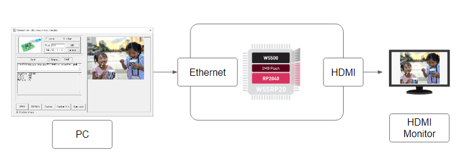
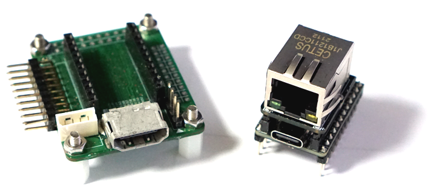
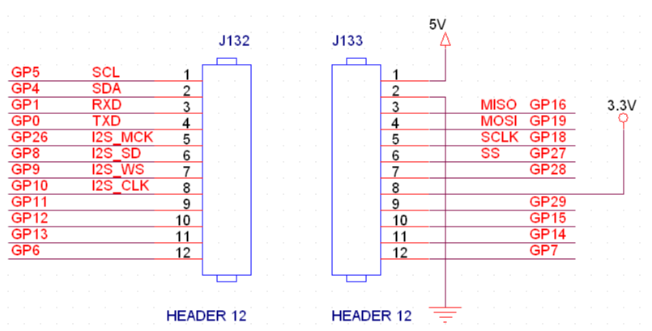
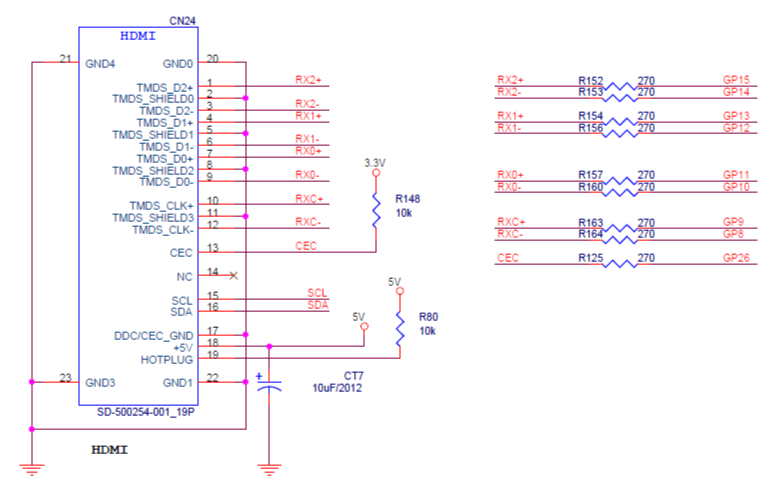

# Ultra-low-cost, network-based HDMI output module

The W55RP20 is a System in Package (SIP) that combines the W5500, a low-cost Ethernet solution chip, and the low-cost RP2040 with ARM dual-core base into one chip.
It seems to be a very good chip for a small and inexpensive Ethernet solution.
As a small and inexpensive network example, we want to build an inexpensive module that can output an advertisement image sent over Ethernet to an HDMI monitor.

System Block Diagram
When you send an image from a PC through the network, the W55RP20 receives it and outputs it to an HDMI monitor. In addition, we added a function to automatically capture and send the screen.

# Project Link
https://nexp.tistory.com/category/RaspberryPi/W55RP20
https://maker.wiznet.io/nexp/contest/ultra%2Dlow%2Dcost%2Dnetwork%2Dbased%2Dhdmi%2Doutput%2Dmodule/

# H/W Board

# H/W Schametic

# Test Video

